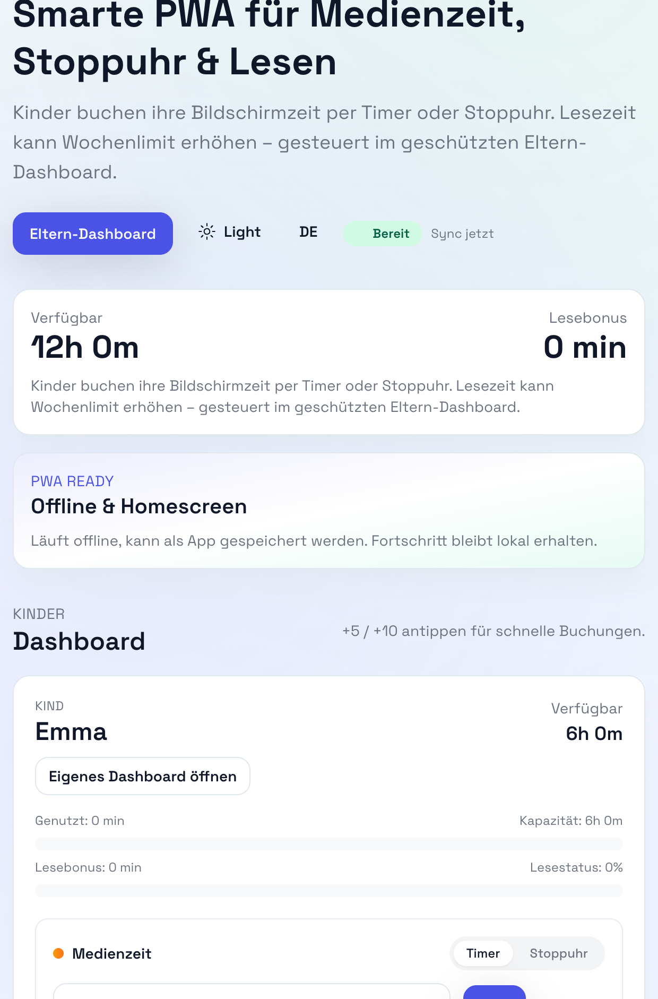
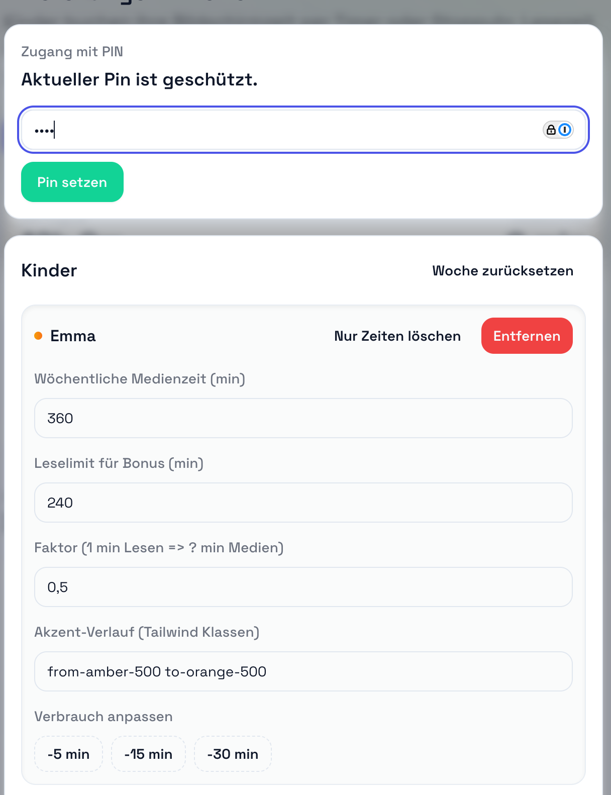
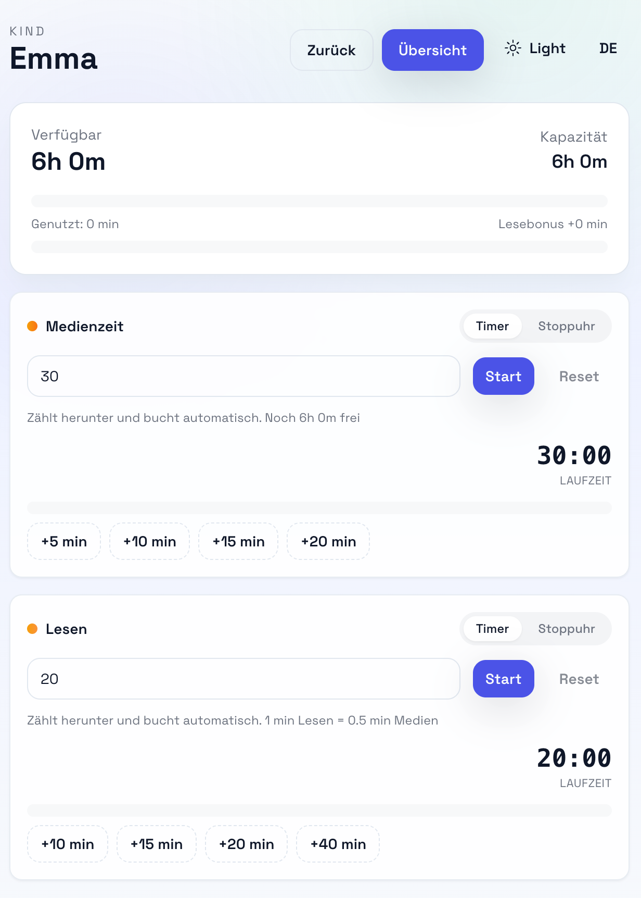

# Medienzeit PWA

Vue 3 + Vite PWA zum Tracken wöchentlicher Medienzeit. Kinder buchen ihre Zeit via Timer oder Stoppuhr, Lesezeit schaltet zusätzliche Minuten frei. Elternbereich ist per PIN geschützt.

- UI: Tailwind + shadcn-inspirierte Komponenten
- State: Pinia + LocalStorage-Persistenz
- PWA: Offline-ready, Homescreen-installierbar (Workbox SW)

## Inhalt

- [Funktionen](#funktionen)
- [Screenshots](#screenshots)
- [Schnellstart](#schnellstart)
- [Build / Tests](#build--tests)
- [English summary](#english-summary)
- [Server Sync & Cron](#server-sync--cron)

## Funktionen

- **Kinder-Dashboards**: Timer oder Stoppuhr pro Kind für Medien- und Lesezeit, inkl. Schnellbuchungen (+5/+10/+15/+20) und Fortschrittsbalken.
- **Lesebonus**: Lesezeit kann wöchentliche Medienzeit erhöhen, Faktor konfigurierbar.
- **Eltern-Dashboard**: PIN-geschützt, Kinder anlegen/bearbeiten/löschen, Limits setzen, Wochen-Reset (global/je Kind), Verbrauch reduzieren.
- **Live-Timer-Hinweis**: Laufende Timer werden tabsynchron angezeigt (BroadcastChannel), Timer laufen nach Reload weiter (Persistenz in LocalStorage).
- **Theme & Language**: Light/Dark-Mode-Toggle (respektiert System) und DE/EN-Umschaltung.
- **PWA**: Installierbar, offlinefähig; State bleibt lokal erhalten, optionaler Sync-Endpunkt.

## Screenshots








## Backend / Sync

- PHP-API unter `server/api/state.php` (GET) und `server/api/sync.php` (POST). Zustände liegen in `server/data/state.json`.
- Env/Secrets:
  - Frontend: `VITE_API_BASE` (Standard `/server`), `VITE_API_KEY` (optional Bearer Token).
  - Server (Apache/PHP): `MEDIENZEIT_API_KEY` (muss mit `VITE_API_KEY` matchen, sonst 401).
- Sync-Flow: App lädt bei Start `/api/state.php`, persistiert lokal, pollt alle 10s, sendet Änderungen als Events an `/api/sync.php` (add/update/delete/log/reset).
- Noindex: `index.html` enthält `meta robots=noindex,nofollow`.
## Schnellstart

```sh
npm install
npm run dev
```

## Build / Tests

```sh
npm run build    # Prod-Build + Service Worker
npm run test:unit
npm run lint
```

## English summary

- Smart PWA for family screen-time tracking with timer/stopwatch and reading bonus per child.
- PIN-protected parent dashboard to set limits, factors, accents, and reset weeks.
- Offline-ready; add to homescreen. State is persisted locally and can be synced to a backend endpoint.
- Quick deploy via GitHub Actions (push to `live` copies `dist/` over SSH using secrets).

## Server Sync & Cron

- Sync-Events werden in `src/stores/sync.ts` gesammelt und an `/api/sync.php` gepostet; `VITE_API_BASE` (default `/server`) und optional `VITE_API_KEY` setzen.
- Wöchentlicher Reset (Sonntag 23:59): Cronjob auf dem Server anlegen, z. B. per `server/reset_week_cron.sh`:
  - `API_URL=https://example.com/api/reset-week API_TOKEN=token ./server/reset_week_cron.sh`
  - Crontab: `59 23 * * 0 API_URL=... API_TOKEN=... /path/to/reset_week_cron.sh >/tmp/medienzeit-reset.log 2>&1`
- Lokale PHP-Entwicklung: ddev-Config liegt unter `.ddev/`; API unter `/server`, `VITE_API_BASE` anpassen, optional `VITE_API_KEY`/`MEDIENZEIT_API_KEY` setzen.

- Push: Web Push über PHP (`server/api/subscribe.php` speichert Subscriptions, `server/api/sync.php` sendet optional Push bei timerStop). Setze `VITE_VAPID_PUBLIC_KEY` im Build und serverseitig `MEDIENZEIT_VAPID_PUBLIC/PRIVATE/SUBJECT` (VAPID-Keys). Subscriptions liegen in `server/data/subscriptions.json`.


## Project Setup

```sh
npm install
```

### Compile and Hot-Reload for Development

```sh
npm run dev
```

### Type-Check, Compile and Minify for Production

```sh
npm run build
```

### Run Unit Tests with [Vitest](https://vitest.dev/)

```sh
npm run test:unit
```

### Lint with [ESLint](https://eslint.org/)

```sh
npm run lint
```
